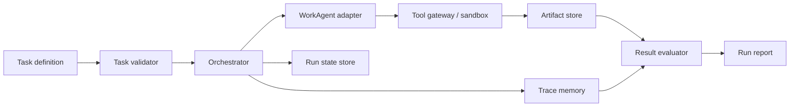

# Harness Architecture

## Scope

This document is the Phase 1A design for a runnable Harness + WorkAgent pipeline. It does not claim implementation or execution.

## Components

| Component | Responsibility | Mutability boundary |
|---|---|---|
| Task validator | Validate task schema, input files, risk and expected constraints | Read-only task input |
| Orchestrator | State machine, retries, cancellation, idempotent run coordination | May update run state, not evaluator policy |
| WorkAgent adapter | Translate canonical task into provider-specific calls | Provider-specific implementation only |
| Tool gateway | Allowlisted tools, argument checks, timeout and resource limits | Candidate skill cannot expand allowlist |
| Sandbox manager | Isolated work directory and process boundary | Candidate output isolated per run |
| Artifact store | Content-addressed inputs/outputs/log references | Append-only evidence |
| Trace memory | Structured events, tool calls, failures and timings | Append-only during run |
| Result evaluator | Hard assertions, Office structure checks and configured quality metrics | Version-pinned, read-only to candidate |
| State store | Run lifecycle and resume checkpoints | Transactional updates |
| Report generator | Human-readable Markdown/JSON/CSV summaries | Derived output only |

## Safety boundaries

- Candidate skill code cannot modify the evaluator, hidden tasks, registry policy or artifact evidence for the same run.
- Tools are allowlisted by name and argument schema; shell access is disabled by default.
- Every run has a timeout, cancellation token, work directory and resource budget.
- High-risk tasks require explicit human approval before execution or promotion.
- Failed or partial artifacts remain addressable; no silent overwrite is allowed.

