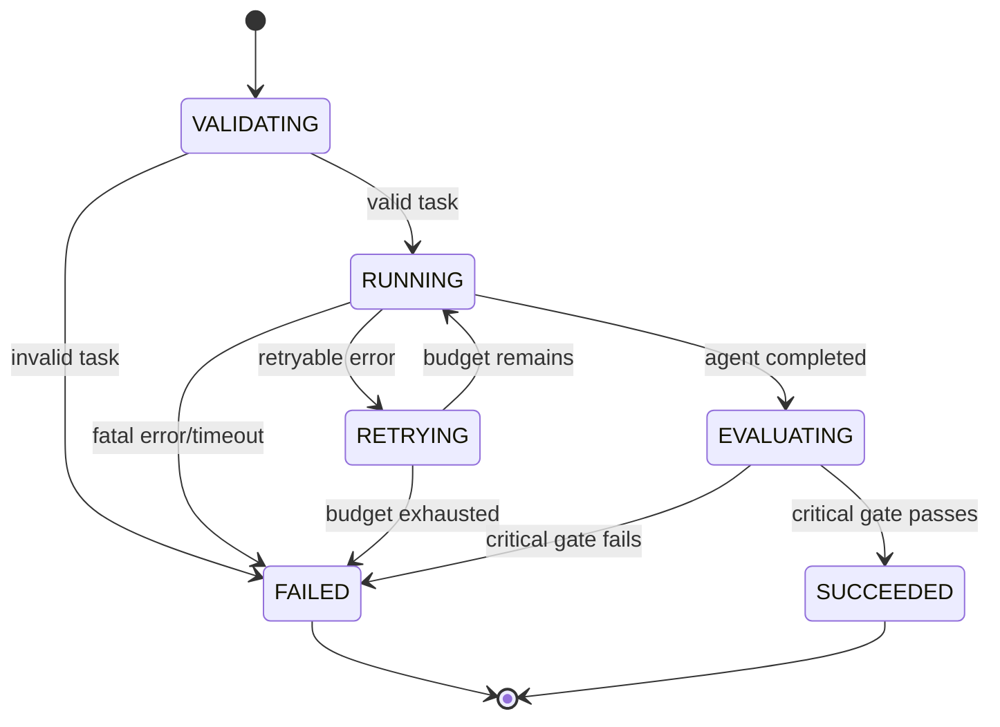

# Pipeline Design

## State machine

## Normal path

1. Create `run_id`, capture Git commit, environment and config.
2. Validate task and copy/hash input artifacts into an isolated workspace.
3. Load immutable skill manifest and start WorkAgent adapter.
4. Execute allowlisted tools, append trace events and persist intermediate artifacts.
5. Finalize output artifacts and run critical format/structure checks.
6. Run configured evaluator and write Markdown, JSON and CSV summaries.
7. Mark `succeeded` only when all critical gates pass.

## Failure/retry/recovery

- Retry only explicitly classified transient errors, with exponential backoff and a bounded attempt count.
- Timeout and cancellation persist a terminal event before cleanup.
- Resume starts from the last committed checkpoint and never reuses an incomplete artifact as final output.
- A run can be replayed from its immutable input manifest and configuration; external nondeterminism is recorded as a limitation.

## Minimum examples

- `smoke.echo`: deterministic mock task proving schema, trace and artifact flow.
- `office.excel_monthly_report`: first real Office task, gated on a functioning Excel adapter.
- `controlled.failure`: malformed tool argument or intentional timeout to exercise failure reporting.

