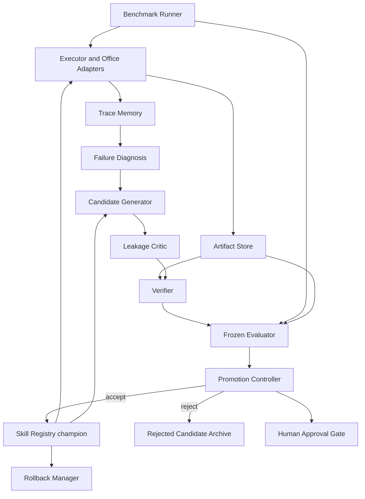

# WorkAgent-RSI Architecture

## Scope and autonomy

Phase 2 defines a bounded harness-level RSI system. The system automates execution of a human-defined improvement procedure (L1) and may choose among approved intervention types (bounded L2). Humans retain the mission, editable-component policy, protected evaluation, resource authority and final approval for high-risk changes. Model-weight training, autonomous objective revision and unrestricted evaluator co-evolution are outside the initial scope.

## System architecture

## Trust zones

| Zone | Components | Rights |
|---|---|---|
| Candidate zone | generator output, candidate prompt/code/tests | Write only candidate workspace |
| Execution zone | executor, Office adapters, sandbox | Execute allowlisted operations with quotas |
| Evidence zone | trace memory, artifact store, run configuration | Append-only during a run |
| Evaluation zone | verifier, frozen evaluator, protected tasks | Read candidate artifacts; candidate has no write access |
| Governance zone | promotion, registry, rollback, human approval | Accept/reject/version; cannot alter historical evidence |

## RRSI regularization

At round `t` of `T`, the candidate generator receives an edit budget:

`b_t = ceil(b_min + (b_max - b_min) * 0.5 * (1 + cos(pi*t/T)))`.

Every edit is atomic and identifies one component, one hypothesis and one expected measurable effect. The selector rejects leakage before full evaluation, estimates a champion noise band `delta`, prevents score declines below the noise-adjusted floor, and requires added cost to be justified by gain. Components with no positive contribution over the pruning window become deletion candidates.

## Promotion conditions

A candidate is promoted only when all non-compensatory gates pass:

1. Schema, permission, sandbox, format and safety verification pass.
2. No task identifiers, answers or protected values appear in the patch.
3. Develop improvement exceeds `delta` or satisfies the configured within-band novelty rule.
4. No critical regression occurs, and aggregate regression remains within tolerance.
5. Hidden/OOD results do not cross the degradation limit.
6. Added tokens, tool calls and latency satisfy the cost envelope.
7. Results reproduce for the required seeds/runs.
8. High-risk candidates receive human approval.

## Rollback

Registry versions are immutable and form a parent-linked DAG. Deployment points to a champion alias, never overwrites a version. Rollback moves the alias to the last accepted version and records the triggering monitoring evidence. Historical runs continue to reference their original skill, evaluator, task and environment hashes.
