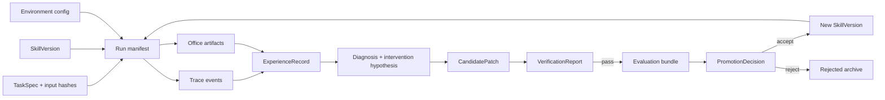

# RSI Data Flow

## Provenance rules

- Every record carries schema version, creation time, Git commit and content hash.
- Raw traces and artifacts are immutable. Derived features reference their source hashes.
- Candidate generation sees evolve/develop diagnostics but not hidden task content.
- Evaluation bundles retain per-task results, not only averages.
- When an evaluator version changes, affected scores are not compared directly without re-evaluation.
- Sensitive document contents remain in access-controlled storage; reports use redacted identifiers.

## Data lifecycle

1. Ingest and validate task/input licenses and hashes.
2. Execute champion under a fixed run manifest.
3. Store raw trace/artifact evidence.
4. Derive failure labels and candidate-generation context.
5. Verify candidate statically and dynamically.
6. Evaluate on allowed splits; reveal only aggregate hidden results to generator-facing systems.
7. Persist decision and version lineage.
8. Revalidate or retire skills when executor, task distribution or evaluator changes.

## Leakage controls

- Group related templates and source documents before splitting.
- Deduplicate by exact hash, normalized text hash and structural fingerprint.
- Keep hidden IDs and expected outputs outside candidate workspaces.
- Audit patches for task-specific names, values and answer fragments.
- Record every adaptive access to develop data and cap search rounds.
