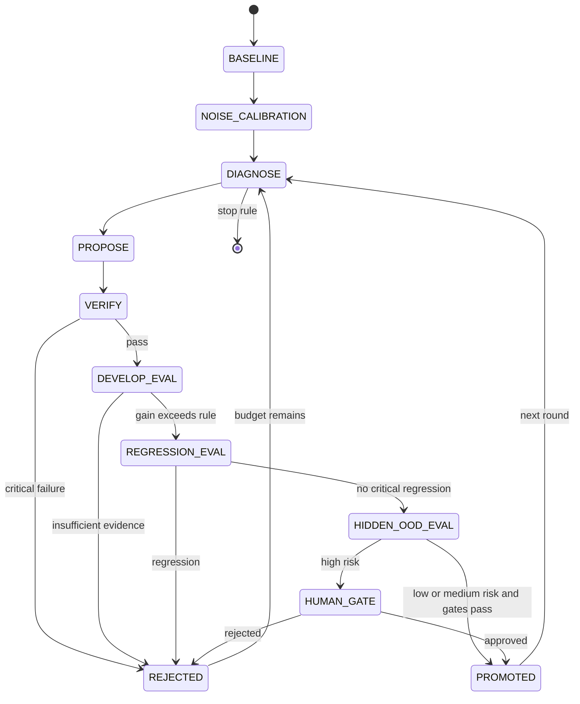

# RSI Training and Optimization Flow

The initial optimization target is a skill/harness package. “Training” includes prompt search, tool-policy search, Office script repair and verifier/test generation. Model-weight updates are a later optional track.

## Optimization stages

### Stage A Pilot

Use 30 tasks, ten per Office domain, to validate schemas and graders. Run fixed prompt and single-pass self-refine baselines. No research claim depends on pilot significance.

### Stage B Excel closed loop

Prioritize deterministic cell, formula, formatting and chart assertions. Compare fixed skill, self-refine, generator-only, generator+verifier and full RSI under matched candidate budgets.

### Stage C Word and PowerPoint expansion

Add OOXML, render and visual checks. Preserve the same promotion controller while allowing domain-specific evaluators.

### Stage D Transfer and robustness

Freeze evolved skills and test unseen templates, cross-domain components and a second executor/model. Measure activation, faithful use and downstream benefit separately.

## Stop rules

- Candidate budget exhausted.
- Three consecutive rounds produce no gain beyond `delta`.
- Expected validated gain falls below projected cost.
- Unsafe action or critical regression rate crosses zero-tolerance gate.
- Evidence integrity, evaluator independence or environment reproducibility fails.
- Human reviewer stops a high-risk branch.
